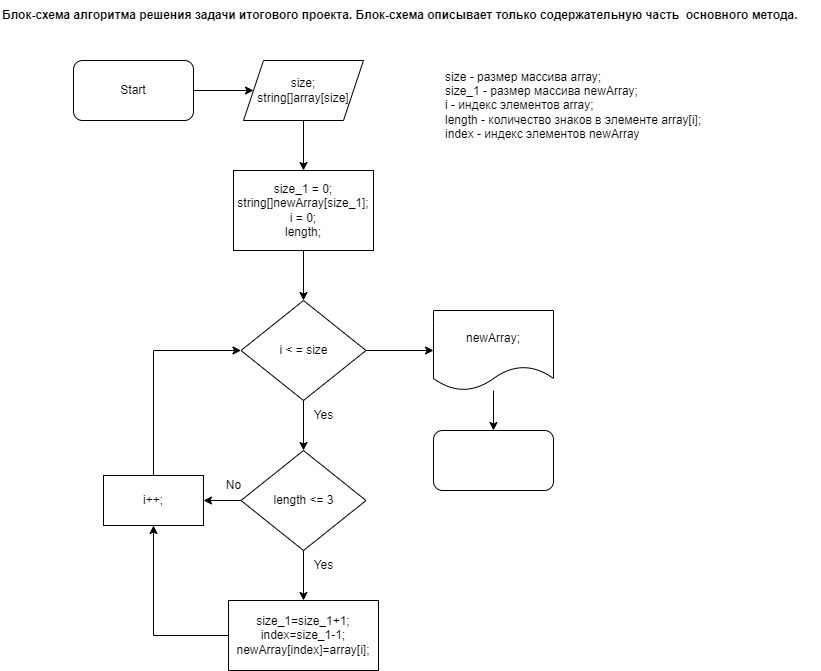

Readme file for the first training block's Finaly Project in C#.
This file describes the algorithm for solving a Finaly Project's problem.

November 21, 2022. 17:45

Author: Galina Dei.  

## The task ## 
**Написать программу, которая из имеющегося массива строк сформирует массивиз строк, длина которых меньше либо равна 3 символа. Первоначальный массив можно ввести с клавиатуры, либо задать на старте выполнения алгоритма. При решении не рекомендуется пользоваться коллекциями, лучше обойтись исключительно массивами**

## Output (examples): ##

**["hello", "2", "world", ":-)"] -> ["2", ":-)"]**

**["1234", "1567", "-2", "computer science"] -> ["-2"]**

## Block diagram of the algorithm for the  solution's main content part: ##

 

In this flowchart there isn't algorithms  for displayng the source and final aarays on the screen because we consider them  routine methods.

## General course of the solutinon ##

1. The general course of the solutinon begins with the declaration of the string array and its initialization.
2. Next step - the method of printing the array **PrintArray** was announced.
3. Onwards, the method **CreateArrayFromSelectedElements** (next -the  Method) of searching for strings of size less than or equal to 0 and creating a new array from these strings was announced. 

>*This Method (see the block diagram) gets on the input our string array. Its work based on the method Array.Resize, which allows you to increase array's size every time as it needed.
First the Method creates a new string array which will be the its final result.
Then it uses a loop that runs through the elements of the original array and each time as it findes a string of the desired size increases the size of the new array by one and assaigns the found value to its element. At the outpu of the Method, we get a new array of strigs of required size.*

4. The main code contains two appeals to the method **PrintArray** (in the first case the input is the source array, in the second case the input is the result of the method **CreateArrayFromSelectedElements**), an appeal to the method **CreateArrayFromSelectedElements** (the input is the source array) and some several appeals to the method **Console,Write()** for the printing of the some symbols required to display the result in the appropriate form (for example, square brackets and an arrow).

